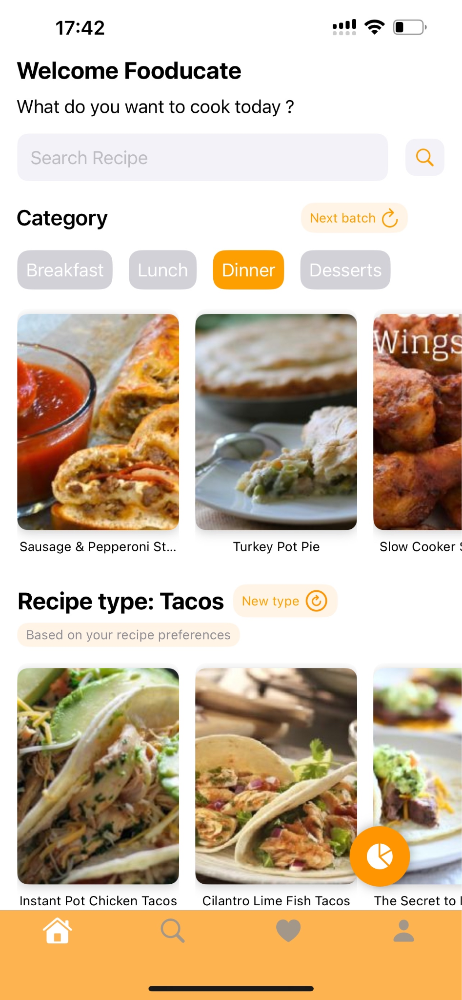
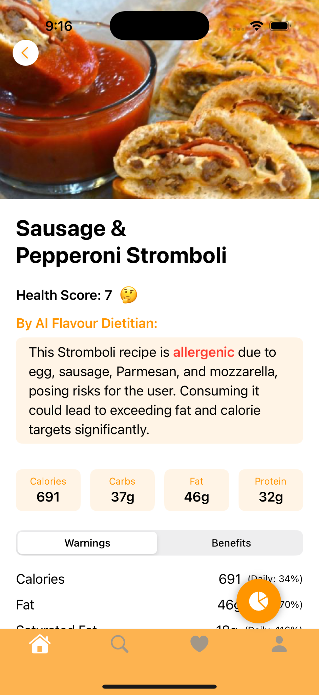
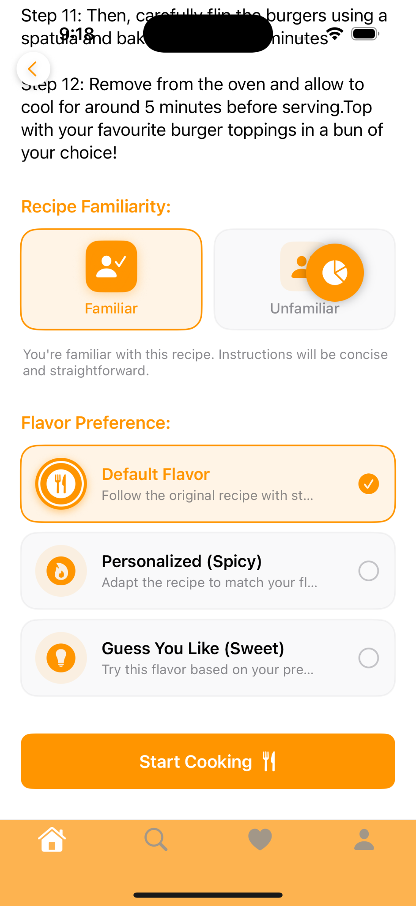
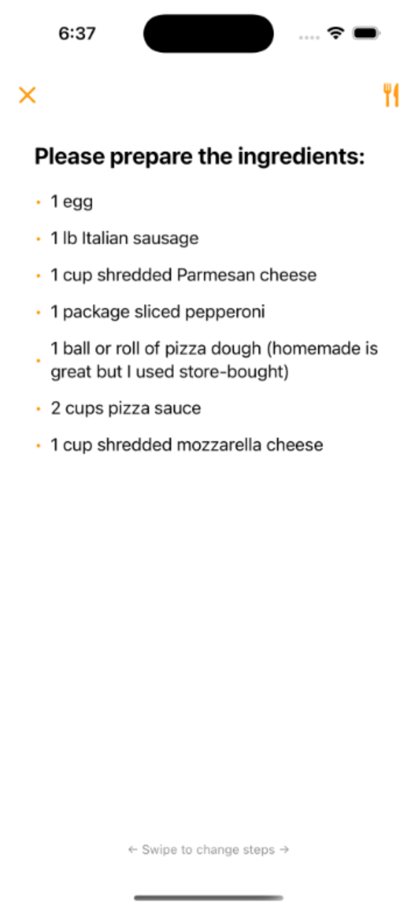
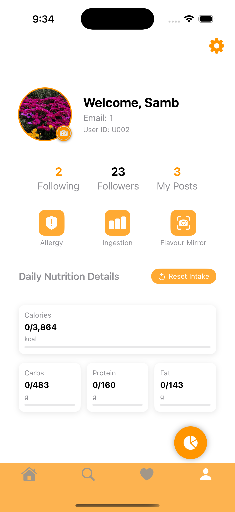
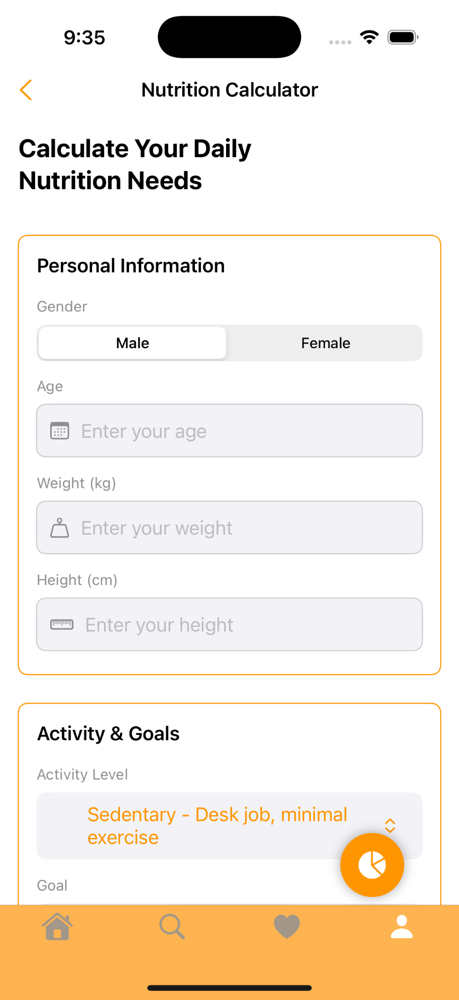
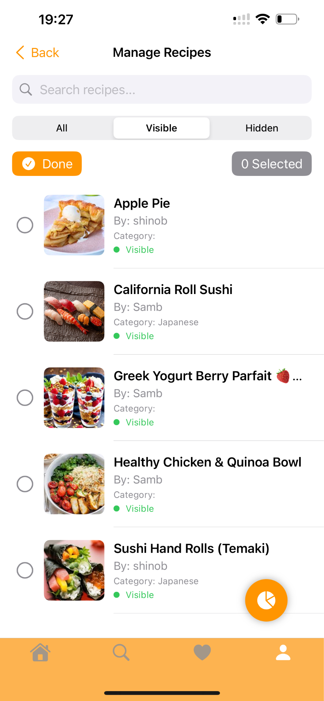
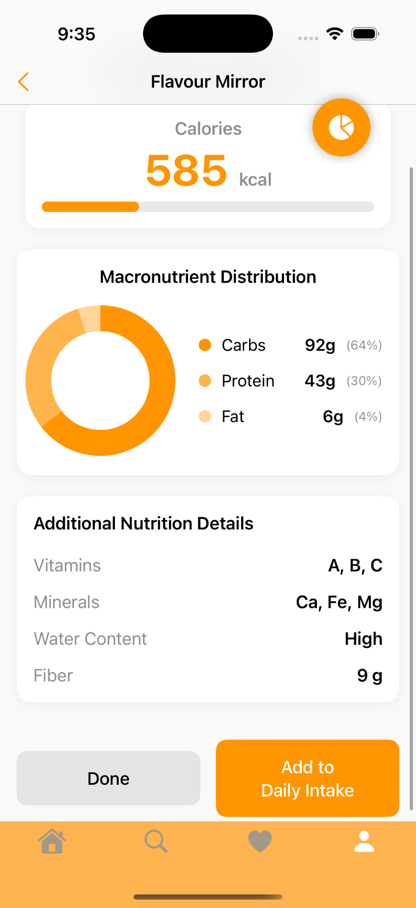
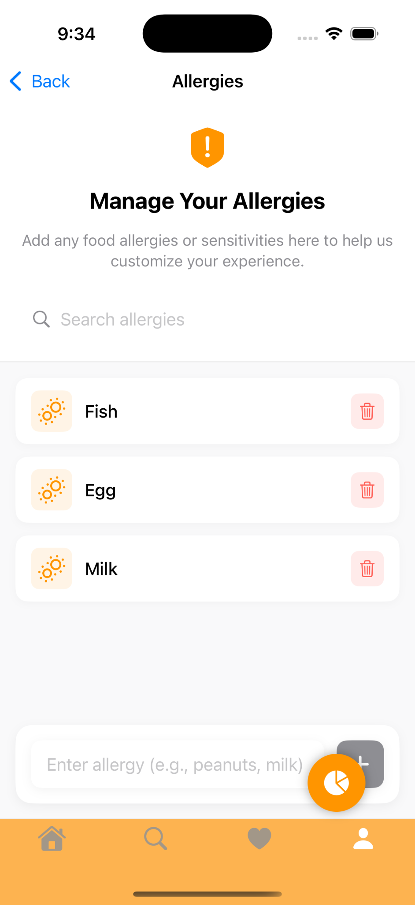

# Fooducate iOS

Fooducate is an AI-powered recipe discovery and cooking assistant developed as a Final Year Project. The application helps users discover personalised recipes, receive cooking guidance, analyse meal nutrition, and interact with recipes through hands-free controls.

## Features

* Personalised AI-powered recipe recommendations based on user preferences, cooking level, dietary requirements, allergies, and activity history.
* AI-assisted recipe search and ingredient recognition.
* Meal photo analysis with nutrition estimation and visual nutrition reports.
* Step-by-step cooking guidance with built-in cooking timers.
* Hands-free cooking assistance using gesture recognition and voice commands.
* Allergy and dietary alerts based on recipe and meal information.
* Community features including recipe sharing, likes, follows, comments, and reviews.

## Tech Stack

* Swift
* SwiftUI
* Firebase Authentication
* Firebase Firestore
* Firebase Storage
* OpenAI API / GPT Vision API
* Spoonacular API
* Apple Vision Framework
* Apple Speech Framework
* AVFoundation
* Imgur API

## My Contributions

* Designed and developed the application UI using SwiftUI.
* Designed the Firestore database schema and data relationships.
* Planned and implemented the overall application workflow.
* Integrated Firebase services for authentication, data storage, and backend management.
* Developed hands-free cooking controls using gesture recognition and voice commands.
* Integrated AI-powered recipe recommendation, ingredient recognition, and nutrition analysis features.
* Configured external API integrations including OpenAI, Spoonacular, and Imgur.

## Screenshots

The screenshots below demonstrate the main app flow, including recipe discovery, recipe details, cooking mode, nutrition tools, and user profile management.

| Home | Recipe Detail | Recipe Overview |
| --- | --- | --- |
|  |  |  |

| Start Cooking | Profile | Nutrition Calculator |
| --- | --- | --- |
|  |  |  |

| Manage Recipes Admin | Flavour Mirror | Allergies |
| --- | --- | --- |
|  |  |  |

## Setup

1. Open the project in Xcode.
2. Add your own Firebase configuration file:
   `GoogleService-Info.plist`
3. Configure the required API keys.
4. Build and run the application on an iOS Simulator or physical device.

## Security Notes

API keys, environment files, and Firebase configuration files are excluded from this repository and should not be committed to source control.

This project uses placeholder configuration values in the public repository. Developers must provide their own API keys and Firebase configuration files to run the app locally.

## Disclaimer

This project is an academic prototype. Nutrition information is provided for demonstration purposes only and should not be considered medical or dietary advice.

## License

This project is licensed under the MIT License.

## Demo Preview

Full demo video:https://youtu.be/UA6tuPU3gvk
